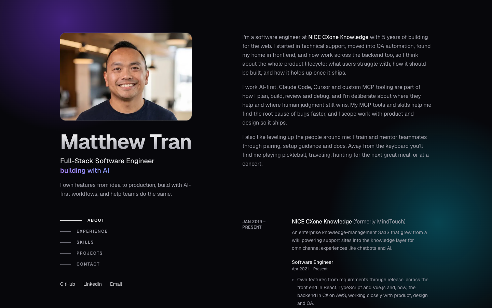

# matthew-tran.com

Personal portfolio for Matthew Tran, a software engineer building with AI. Live at [matthew-tran.com](https://matthew-tran.com).



## What's on the page

- **About**: who I am and how I work (AI-first, MCP tooling, mentoring)
- **Experience**: NICE CXone Knowledge (formerly MindTouch) with Software Engineer, QA and Support roles, then MadCap Software and earlier work
- **Skills**: front end, back end and cloud, testing and CI/CD, observability, AI tooling
- **Projects**: four featured projects with previews, plus a `/projects` page listing all of them (Chat, Shop, Unpaywall, Baby Dashboard, Upkeep, Matthew's Cup)

## Stack

- [Next.js](https://nextjs.org) 16 (App Router) and React 19
- [Tailwind CSS](https://tailwindcss.com) v4
- TypeScript, ESLint
- [Geist](https://vercel.com/font) via `next/font`
- Deployed on [Vercel](https://vercel.com), auto-deploying from `main`

## Getting started

```bash
npm install
npm run dev
```

Open [http://localhost:3000](http://localhost:3000).

| Script | What it does |
| --- | --- |
| `npm run dev` | Start the dev server |
| `npm run build` | Production build |
| `npm run start` | Serve the production build |
| `npm run lint` | Run ESLint |

## Editing content

Copy and data are separate from markup:

- [`src/data/site.ts`](src/data/site.ts): name, links, site description
- [`src/data/experience.ts`](src/data/experience.ts): roles and bullets
- [`src/data/projects.ts`](src/data/projects.ts): project cards; set `featured: true` to show one on the homepage (images live in `public/projects/`)
- [`src/data/toolbox.ts`](src/data/toolbox.ts): skills groups
- [`src/app/page.tsx`](src/app/page.tsx): page layout; [`src/components/`](src/components) holds the scroll-spy nav, tag and password reveal

SEO and sharing: metadata in `src/app/layout.tsx`, a generated social image in `src/app/opengraph-image.tsx`, plus `robots.ts`, `sitemap.ts` and Person JSON-LD on the page.

## Deployment

Pushing to `main` triggers a Vercel deployment.
